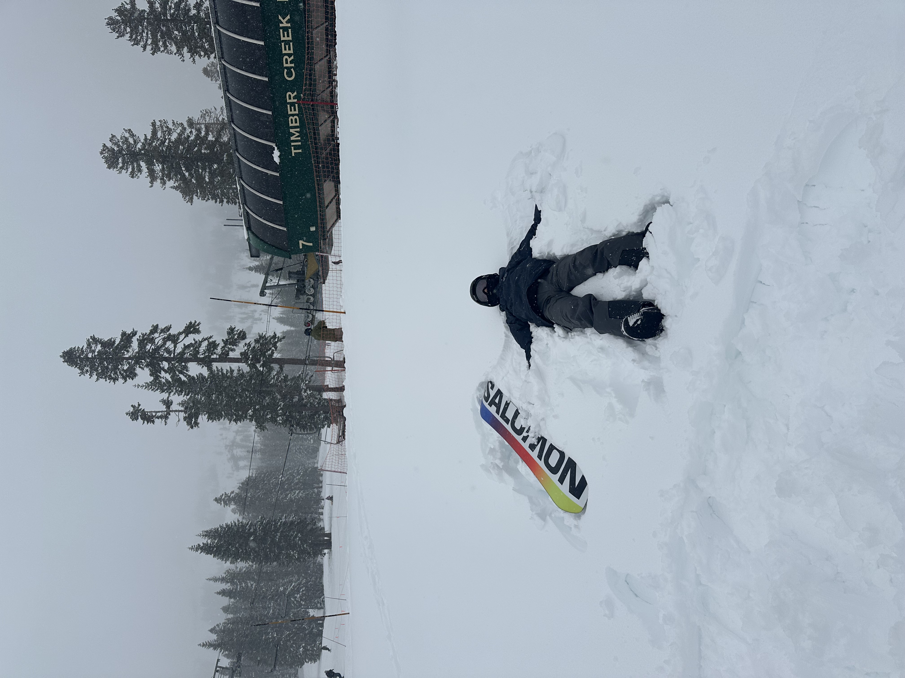
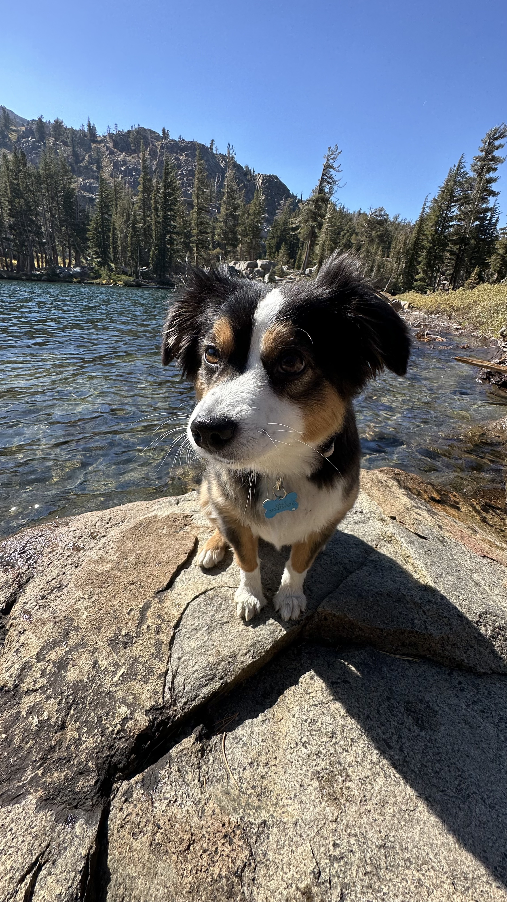
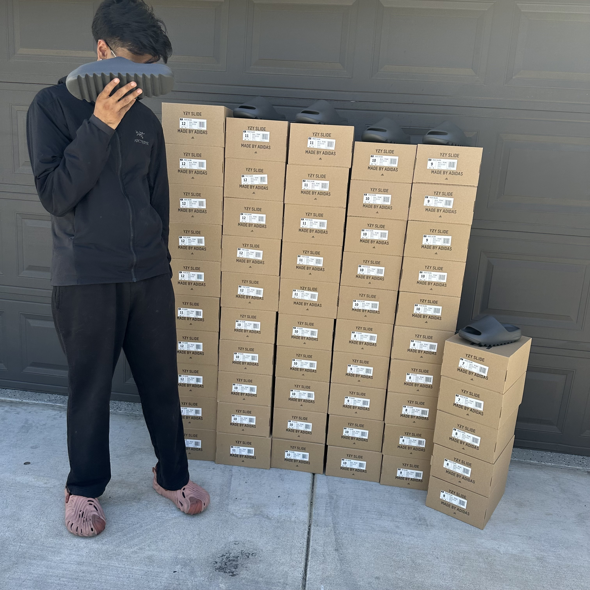

A few of the things, people, and experiences that have shaped who I am outside of school and work:

## Snowboarding

Snowboarding was something I had always wanted to try, but for a long time, I never thought I’d have the time or money to fully commit to it. Three years ago, I finally decided to give it a shot, buying my first season pass and a complete setup. Since then, it’s become something I look forward to every winter. Kirkwood and Sierra-at-Tahoe are my favorite resorts, and over the years I’ve progressed to riding rails, boxes, and small jumps. More than anything, I enjoy snowboarding because it gives me a chance to disconnect and spend a day in the mountains.

{fig-align="center" width="400px"}

## Wally!

My Australian Shepherd has been a huge part of my life and is easily my favorite companion. Whether we’re going on walks, getting outside, or just hanging around at home, he always finds a way to make things more entertaining. Aussies are known for being intelligent and energetic, and he definitely lives up to that reputation. Having him around has taught me a lot about patience and responsibility.

{fig-align="center" width="400px"}

## ValleySoles

I never really saw myself as an entrepreneur until one random day during the COVID lockdown. Stuck at home and looking for a way to make some extra money, I decided to combine my interest in sneakers with an opportunity I saw in the resale market. I started small, buying used shoes, cleaning them up, and reselling them online. As things picked up, I launched Valley Soles and began using software to automate online checkouts and expand my inventory. What started as a side hobby eventually replaced my part-time job and became my first real experience building and running something of my own.

{fig-align="center" width="400px"}
